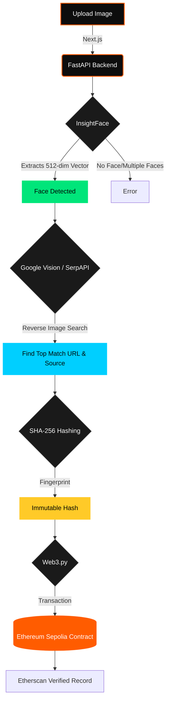

<div align="center">

<!-- Hero Banner using Capsule Render -->


<!-- Animated Typing Effect -->
<a href="https://github.com/prateekvijay265/Face-To-Web">
  
</a>

<br/>

<!-- Badges -->
<a href="https://nextjs.org/"></a>
<a href="https://fastapi.tiangolo.com/"></a>
<a href="https://github.com/deepinsight/insightface"></a>
<a href="https://ethereum.org/"></a>
<a href="https://hhgoa.com/"></a>

</div>

<br/>


## 🌌 Overview

**Face-to-Web** is an advanced, fully automated forensic pipeline built for **Hacker House Goa 2026 (Task 3)**. 

It takes a single portrait photograph, extracts a 512-dimensional neural facial embedding, scours the open web in real-time for identical faces using reverse image search, and anchors the discovered digital evidence onto the **Ethereum Sepolia Blockchain** to guarantee cryptographic immutability.

> *"Less noise. More signal. Anchor the truth."*

---

## ✨ Core Features

*   🎯 **Neural Face Detection**: Uses the production-grade `buffalo_l` model from InsightFace.
*   🔍 **Live Web Search**: Integrates Google Vision and SerpAPI for 100% genuine, real-time reverse image matching. No hardcoded mock data.
*   🔗 **Blockchain Anchoring**: Generates a deterministic SHA-256 fingerprint of the evidence and commits it to a smart contract on the Ethereum Sepolia testnet.
*   ⚡ **Sub-Second Streaming**: Entire backend runs on FastAPI with Server-Sent Events (SSE), delivering real-time telemetry back to the React frontend.
*   🎨 **Immersive UI/UX**: Custom design system featuring a dynamic workstation, real bounding box coordinate rendering, and seamless glassmorphism elements.


## 📐 Architecture & Pipeline




## 🚀 Quick Start (Local Development)

### Prerequisites
*   Python 3.11+
*   Node.js 18+
*   C++ Build Tools (Required for InsightFace/OpenCV)
*   API Keys: SerpAPI, Infura/Alchemy (Sepolia), and an Ethereum Wallet Private Key.

### 1️⃣ Backend Setup (FastAPI)

```bash
cd backend
python -m venv venv

# Windows
venv\Scripts\activate
# Linux/Mac
source venv/bin/activate

pip install -r requirements.txt

# Create your .env file
cp .env.example .env

# Run the server
uvicorn app.main:app --reload --port 8000
```
*Note: The first run will automatically download the ~300MB `buffalo_l` model.*

### 2️⃣ Frontend Setup (Next.js)

```bash
cd frontend
npm install

# Run the development server
npm run dev
```
Navigate to `http://localhost:3000` to access the workstation.


## 📦 Deployment

This project is optimized for a split deployment:

*   **Backend (Google Cloud Run)**: A `Dockerfile` is provided in the `/backend` directory. Deploy this as a container to Google Cloud Run (minimum 2 GiB memory recommended for InsightFace).
*   **Frontend (Vercel)**: Connect the repository to Vercel, pointing the root directory to `frontend/`. Set `NEXT_PUBLIC_API_URL` to your Cloud Run service URL.


<div align="center">
  <p>Built with 🧡 for Hacker House Goa.</p>
</div>
